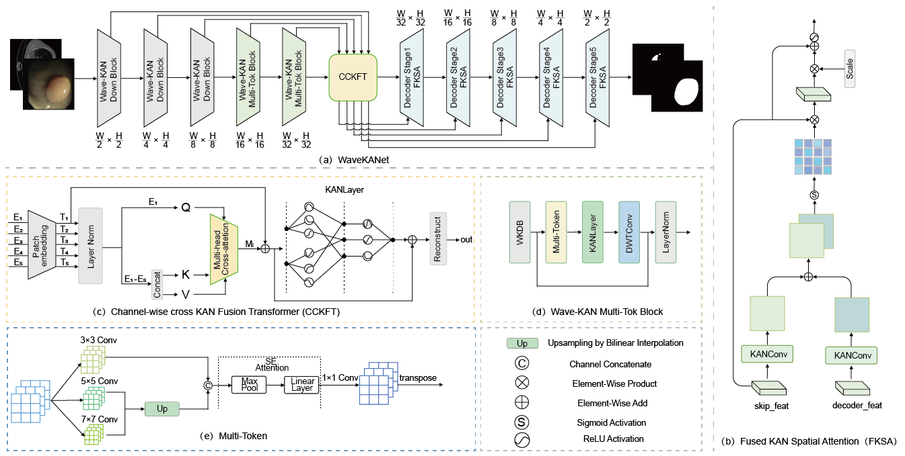

# WaveKANet



## Dependencies

WaveKANet was implemented on *Ubuntu 20.04* with *Python 3.10*. Before training and testing, please create a conda environment and install PyTorch 2.1.2 as follows:

```
conda create -n WaveKANet python=3.10
source activate WaveKANet 
conda install torch==2.1.2
```


Please install other packages using `pip install -r requirements.txt`.

## Quick test for performance

```
python test_seg.py --model_path /path/to/model.pth --data_dir /path/to/dataset --output_dir /path/to/output --batch_size 4
```


